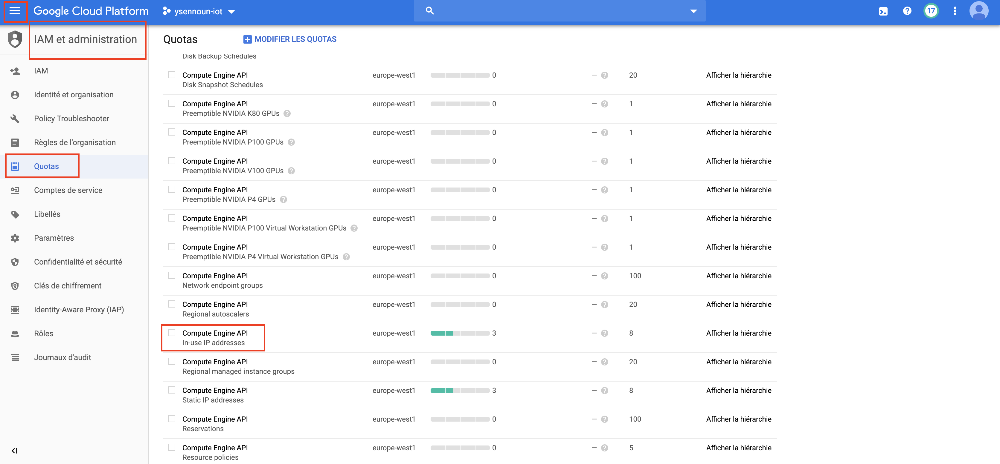
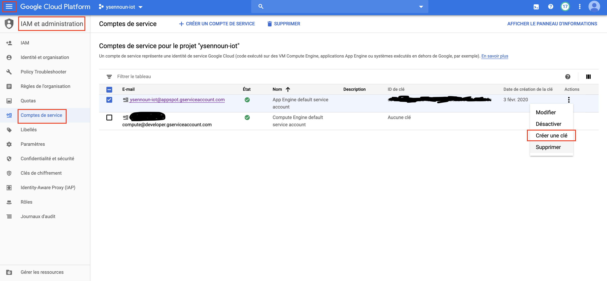
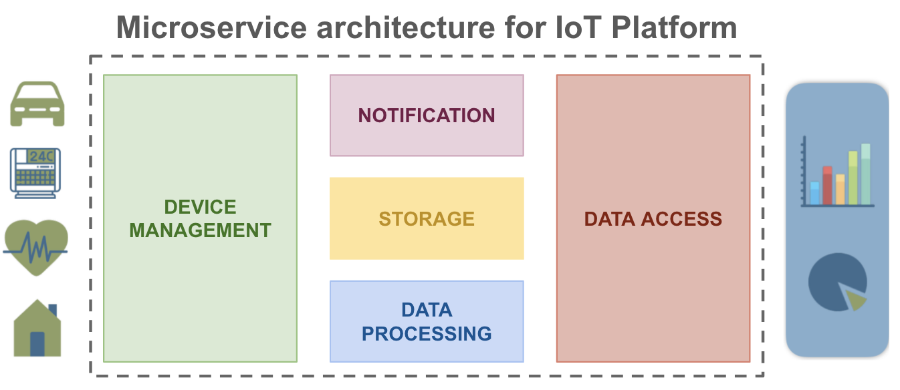
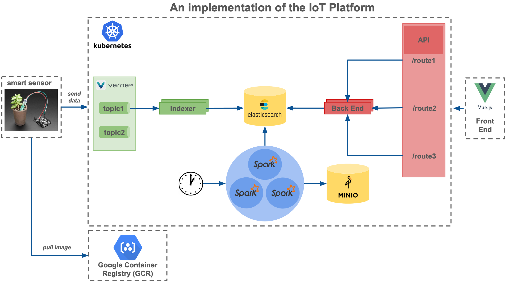

# Project `smart-agriculture-with-k8s`

Build a smart agriculture project with Kubernetes and Knative

## How to begin ?

### GCP Account
Create a [GCP account](https://console.cloud.google.com/)

### GCP Project
Create a GCP project by given a project-id
- example: my-iot-project

### Increase quota for IP addresses
- Go to `IAM and Administration/quota/` (as indicated below)
- Search for `In-use IP addresses` and request to increase quota from 8 IP to 20 IP
- Unfortunately, it takes almost two days to be validated by GCP 

     
### Get private key file
- Go to `IAM and Administration/quota/` (as indicated below)
- Download private key file to be used in gitlab CICD. Indeed, store the content as global environment variable `PRIVATE_KEY_FILE_CONTENT`

       
## Architecture of IoT platform 

First we divide our plateform into microservices, here below the representation:

- Device management: manage reception of data from device
- Notification: send a notification (for example: email) to some users when a data received exceeds some thresholds
- Storage: store data received in different data storages
- Data processing: Predefined Batch processes
- Data Access: Expose data to users through API REST

The corresponding architecture we build to solve the previous representation is as below:

## Configure IoT platform 

### Configure gcloud

Modify in `.gitlab-ci.yaml` for deployment through CICD pipeline and `deploy/deployer.sh` for deployment through command lines 

    PROJECT_ID="your-project-id"
    COMPUTE_ZONE="your-selected-zone"  # for instance europe-west1-b
    COMPUTE_REGION="your-selected-region"  # for instance europe-west1
    CONTAINER_REPOSITORY="your docker repository"  # for instance eu.gcr.io
    PROJECT_NAME="your project name on gcp"  # for instance my-iot-platform

### Run unit tests for IoT Platform with command lines

Run the following script to run all unit tests:

    ./deploy/deployer.sh test-unit

### Install IoT Platform with command lines

Run the following script to install this IoT platform on your GCP Account:

    ./deploy/deployer.sh setup-cluster # create Kuberntes cluster
    ./deploy/deployer.sh deploy-modules <environment> # Deploy all modules 
    
### Delete IoT Platform with command lines

Run the following script to delete the IoT platform on your GCP Account:

    ./deploy/deployer.sh delete-all

#########################################################
1) change mqtt-client
2) elasticsearch Does not have minimum availability
3) ingress error while evaluating the ingress spec: could not find port "80" in service "yse/kn-function-api" 
4) limit IN_USE_ADDRESSES and limit cpu
4) deploy with gitlab

PLAN
1) wait to get more external ip
2) tests e2e
3) check spark is working on k8s
4) script send multiple data and check through chrome
5) check if terraform can be used
6) recheck is working with terraform
7) deploy with gitlab
8) monitoring solution

8) develop web interface code
9) add web code in deployment
10) develop device code
11) add device code in deployment