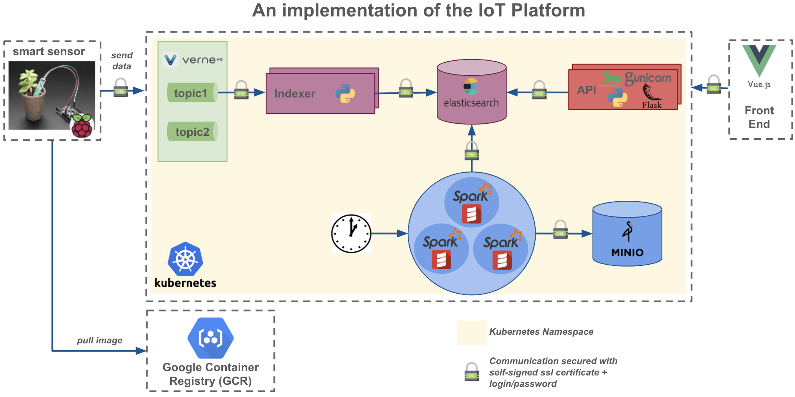

# Project `smart-agriculture-with-k8s`

Build a smart agriculture project with Kubernetes and Knative

## How to begin ?

First you have to:

- Create a [GCP account](https://console.cloud.google.com/)
- Create a gcp project by given a project-id (example: my-iot-project)
- Install [Google Cloud SDK](https://cloud.google.com/sdk/docs/downloads-interactive)
- Login to your gcp account: `gcloud auth login`
- Install `envsubst`
    - MacOS: brew install gettext && brew link --force gettext
    - Ubuntu: apt-get -y install gettext-devel 
    - Centos: yum install gettext-devel
- Install [Helm](https://helm.sh/docs/using_helm/#installing-helm), the package manager for Kubernetes
- Install [Docker](https://docs.docker.com/install/)
- Configure Docker for a specific repository
    - Here we used GCP Container Repository: `gcloud auth configure-docker`

## Architecture of IoT platform 

First we divide our plateform into microservices, here below the representation:

The corresponding architecture we build to solve the previous representation:

## Configure IoT platform 

### Configure gcloud

Modify the following parameters before those commands:

    export PROJECT_ID="your-project-id"
    export COMPUTE_ZONE="your-selected-zone"
    export COMPUTE_REGION="your-selected-region"
    export CONTAINER_REPOSITORY="your docker repository" (for instance eu.gcr.io)
    export PROJECT_NAME="your project name on gcp" (for instance my-iot-platform)
    gcloud config set project ${PROJECT_ID}
    gcloud config set compute/zone ${COMPUTE_ZONE}
    gcloud config set compute/region ${COMPUTE_REGION}
    gcloud components update

### Run unit tests for IoT Platform

Run the following script to run all unit tests:

    ./deploy/deployer.sh test-unit

### Install IoT Platform

Run the following script to install this IoT platform on your GCP Account:

    ./deploy/deployer.sh deploy-all
    
### Delete IoT Platform

Run the following script to delete the IoT platform on your GCP Account:

    ./deploy/deployer.sh delete-all

1) create gcp project with id
2) ask increase quota, for In-use IP addresses (8 ip -> 20 ip)
3) get key and set it in gitlab 
4) deploy with gitlab

