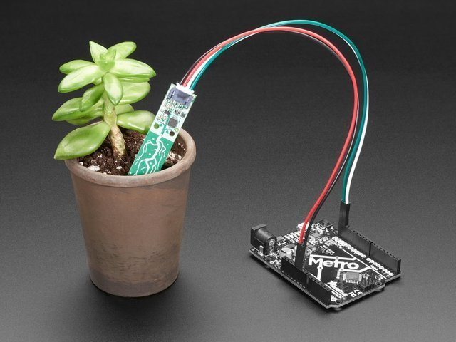
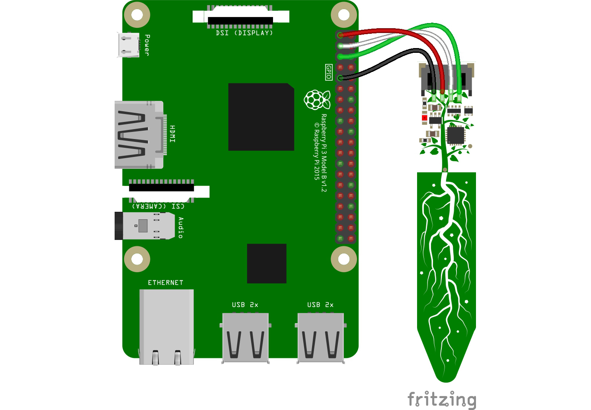

# Device

This section aims to show how to configure a Rapsberry Pi in order to compute and send data to the IoT platform.

## Prototype

Here is an image of the device we search to build. ([source](https://learn.adafruit.com/adafruit-stemma-soil-sensor-i2c-capacitive-moisture-sensor/python-circuitpython-test))

## Raspberry Pi configuration

Follow these steps for Raspberry Pi configuration.

- Get a Raspberry Pi (we use version 3) and a SSD card (8G at least)
- [Install Raspbian OS](https://www.raspberrypi.org/documentation/installation/installing-images/) in your SSD card
- [Set up Wifi connection](https://www.raspberrypi.org/documentation/configuration/wireless/) either through `Desktop` or `Command line`
- [Enable I2C](../documents/i2c.png) by executing command line `raspi-config`

## Hardware configuration

To measure temperature and moisture we use `Adafruit STEMMA Soil Sensor`. All information can be found in this [link](https://learn.adafruit.com/adafruit-stemma-soil-sensor-i2c-capacitive-moisture-sensor/overview).
Wire this sensor to the Raspeberry Pi like below:

- Pi 3V3 to sensor VIN
- Pi GND to sensor GND
- Pi SCL to sensor SCL
- Pi SDA to sensor SDA

## Code configuration

Here is the final stage to configure source code into the Raspberry Pi, fulfill the three following steps:

- Copy `key.json` file into `/home/pi/credentials`
- Copy `run.sh`file into `/home/pi`
- Run command `chmod 755 run.sh`
- Run command `./run.sh install-docker` to install docker
- Run command `./run.sh configure-device`. A password for vernemq will be asked, you need to put the same value specified for variable `MQTT_DEVICE_PASS`